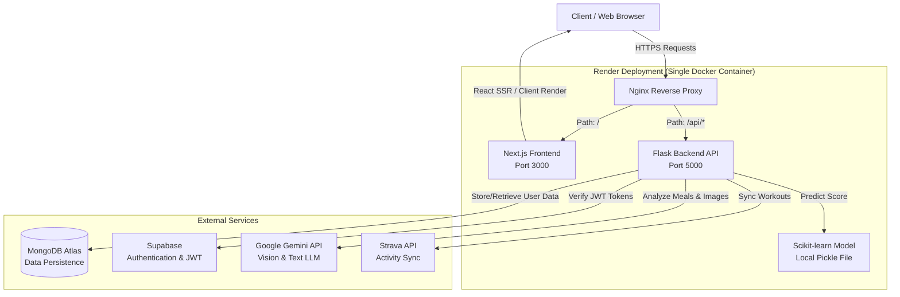

# NutriTrack AI

A full-stack AI-powered nutrition tracking application.

## System Architecture

The following diagram illustrates the complete system architecture, routing, and external service integrations.



## Tech Stack
- **Frontend**: Next.js 16, React 19, GSAP & Lenis (Smooth Scrolling)
- **Backend**: Python, Flask, Scikit-learn (ML modeling)
- **Auth**: Supabase (Google OAuth)
- **Database**: MongoDB Atlas
- **AI/ML**: Google Generative AI (Gemini), OpenAI, xAI Grok
- **Deployment**: Docker, Nginx, Render

## Prerequisites
- Node.js (v20+)
- Python (3.11+)
- Supabase Project (Authentication)
- MongoDB Atlas cluster (Database)
- At least one AI API key (Gemini, OpenAI, or Grok - optional, falls back to offline heuristics)

## Environment Variables
Copy the `.env.example` file to create a `.env` file in the root directory:
```bash
cp .env.example .env
```
Update the `.env` file with your `SUPABASE_URL`, `SUPABASE_ANON_KEY`, `MONGODB_URI`, and at least one AI key.

## Local Development

### 1. Backend Setup
Navigate to the backend directory, install Python requirements, and run the Flask server:
```bash
cd backend
pip install -r requirements.txt
python run.py
```
*The backend API will run on http://localhost:5000*

### 2. Frontend Setup
In a new terminal window, navigate to the frontend directory, install dependencies, and start the Next.js development server:
```bash
cd frontend
npm install
npm run dev
```
*The frontend will run on http://localhost:3000*

## Docker Deployment (Local)
To build and run the application using Docker (this will start the frontend, backend, and Nginx proxy in a single container):
```bash
docker build -t nutritrack-ai .
docker run -p 8080:8080 --env-file .env nutritrack-ai
```
*The application will be accessible at http://localhost:8080*

## Render Deployment (Production)
This project is configured to deploy as a **single Docker web service** on Render.

1. Push this repository to GitHub.
2. On Render, create a new **Web Service** and connect your repository.
3. Render will automatically detect the `Dockerfile`.
4. Set these environment variables in the Render Dashboard:
   - `MONGODB_URI` - your MongoDB Atlas connection string.
   - `SUPABASE_URL` - your Supabase project URL.
   - `SUPABASE_SERVICE_ROLE_KEY` - your Supabase service role key.
   - `GEMINI_API_KEY` - (optional) your Gemini API key.
5. Deploy.

Alternatively, use the `render.yaml` blueprint for one-click setup.
